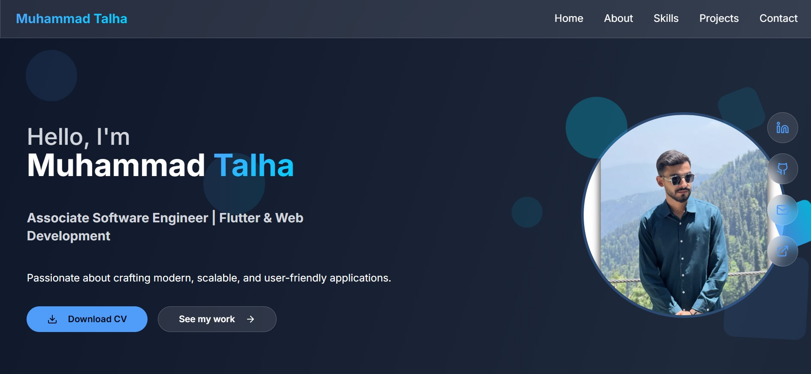

🌐 Muhammad Talha - Portfolio
Welcome to my personal portfolio!
This project showcases my skills, projects, and professional journey as a Software Engineer (Flutter & Web Development).

---

🚀 Features
- Responsive design with modern UI/UX
- Built using React + Tailwind CSS
- Dark/Light theme support
- Projects showcase with live demos
- Downloadable CV
- Contact form integration

---

🛠️ Tech Stack
- **Frontend:** React, Tailwind CSS
- **Version Control:** Git, GitHub
- **Deployment:**  Vercel

---

📂 Folder Structure
client/   → Frontend source code
public/   → Assets (CV, images,)
server/   → backend files

---

## 📸 Screenshots

---

⚡ Setup Instructions
Clone the repo and install dependencies:
# Clone repo
git clone https://github.com/Muhammad-Talha990/portfolio-website.git

# Enter project folder
cd portfolio-website

# Install dependencies
npm install

# Start development server
npm run dev

---

🌍 Live Demo

🔗 View Portfolio: https://your-portfolio-link.vercel.app/

---

📬 Contact
- 📧 Email: talha.sabir4073@gmail.com
- 💼 LinkedIn: https://linkedin.com/in/muhammad-talha-9634b1368
- 🖥️ GitHub: https://github.com/Muhammad-Talha990